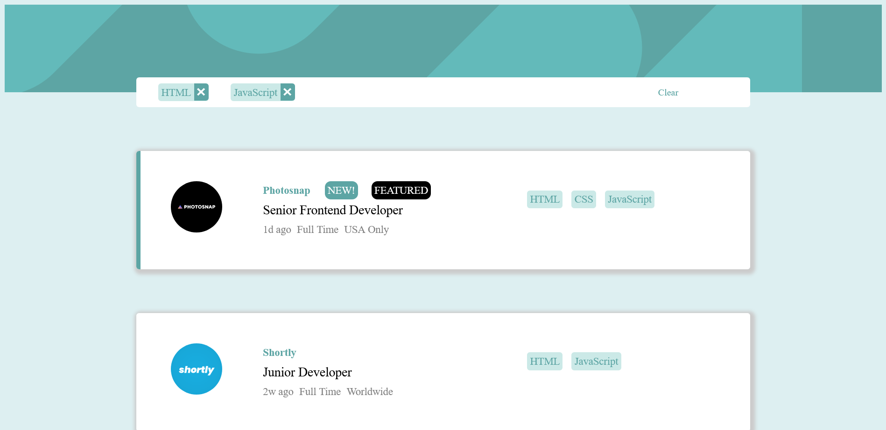
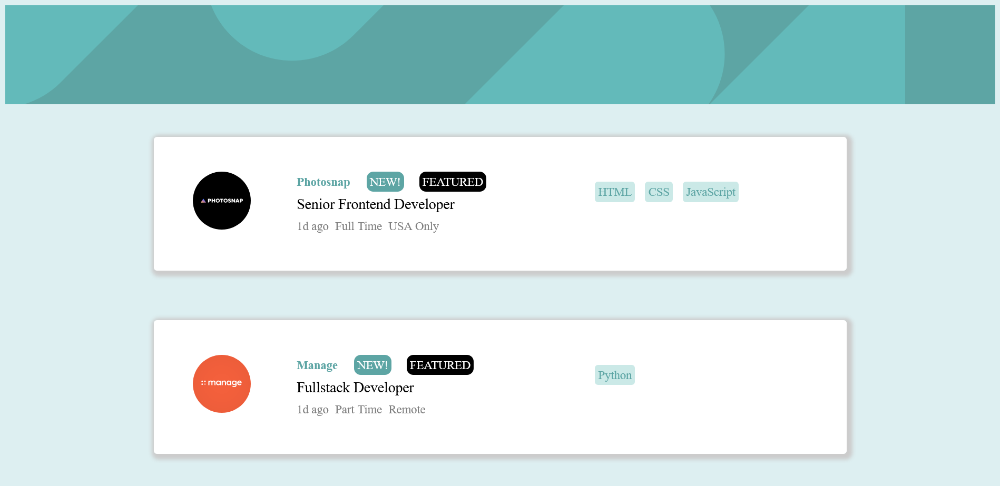
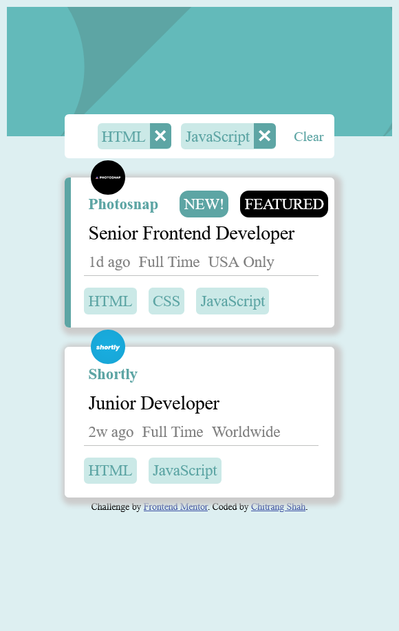

# Job listings App made with React (PSD to HTML)

This is a solution to the [Job listings with filtering app challenge on Frontend Mentor](https://www.frontendmentor.io/challenges/job-listings-with-filtering-ivstIPCt/). 

## Table of contents

- [Overview](#overview)
  - [Description](#description)
  - [Screenshot](#screenshot)
  - [Links](#links)
- [My process](#my-process)
  - [Built with](#built-with)
  - [What I learned](#what-i-learned)
- [Author](#author)

## Overview

A job listing app designed with responsive website using HTML, CSS and JavaScript.

### Description

This app dynamically shows current job listing. User also has ability to filter listing according to categories.
This app is designed to be responsive with mobile friendly approach and following latest standards.
Site performs well in Google lighthouse performance metrics.

### Screenshot

#### Active States Screenshot

#### Mobile Screenshot

### Links

- Solution URL: [https://cwebdev.github.io/Job-Listing-App/](https://cwebdev.github.io/Job-Listing-App/)
- Live Site URL: [https://cwebdev.github.io/Job-Listing-App/](https://cwebdev.github.io/Job-Listing-App/)

## My process

### Built with

- React
- Semantic HTML5 markup
- CSS Flexbox
- Mobile-first workflow

### What I learned

- Creating dynamic content responsive website
- How to filter data using script according to user input in React

## Author

- Website - [Chitrang Shah](https://chitrang.webflow.io/)
- Frontend Mentor Profile - [@cwebdev](https://www.frontendmentor.io/profile/cwebdev)
